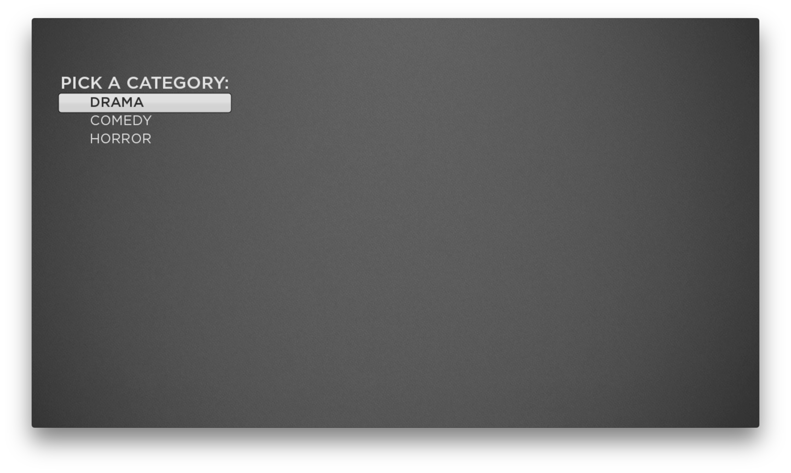

#  Lesson 3  
## Extended Components, Observers, Tasks, Network Requests
In this lesson we will add a category picker that will trigger a network request to load a JSON file.  
Most languages implement an event pattern for asynchronous communication between objects. In SceneGraph the technique is called Field Observers.  For network requests, SceneGraph requires the use of a "task". All HTTP activity must be contained in a task, which spawns a new thread. Threading is a little odd in Roku SceneGraph, read more about it here: https://sdkdocs.roku.com/display/sdkdoc/SceneGraph+Threads   

OK, let's go:

1. In the `components` directory, create a directory called `screens`

1. Inside `screens`, create 2 files: `CategoryScreen.xml` and `CategoryScreen.brs`. Open `CategoryScreen.xml` and add this:

    ``` xml
    <?xml version="1.0" encoding="utf-8" ?>
    <component name="CategoryScreen"
      extends="Group"
      >
      <script type="text/brightscript" uri="pkg:/components/screens/CategoryScreen.brs" />
      <children>
        <!-- color="0x000000" -->
        <Label
          translation="[75, 150]"
            id="env"
            font="font:LargeBoldSystemFont"
            text="PICK A CATEGORY:"/>
        <LabelList
          id="categoryList"
          translation="[100, 200]"
          itemSize="[400,48]"
        />
      </children>
    </component>
    ```

    In CategoryScreen.brs add the following:

    ``` java
    function init()
        m.categoryList=m.top.findNode("categoryList")
        m.categoryList.setFocus(true)
    end function
    ```
1. Modify HomeScene.xml to route to the new screen components by replacing what is there with the following:  
    ``` java
    function init()
    	? "[HomeScene] init"
    	m.centerSquare = m.top.findNode("categoryScreen")
    	m.centerSquare.setFocus(true)
    end function
    ```
1. Save and run the app. It's pretty lame, nothing happens and the category list is empty. Go back to `CategoryScreen.xml` and make this change:

    ``` xml
    <LabelList
      id="categoryList"
      translation="[100, 200]"
      itemSize="[400,48]"
    >
    <ContentNode id = "categories" role = "content" >
      <ContentNode title = "DRAMA"/>
      <ContentNode title = "COMEDY"/>
      <ContentNode title = "HORROR"/>
    </ContentNode>
    </LabelList>
    ```

    Run it now as see the populated list:  
      
    All the UI components require a properly constructed `ContentNode`. Depending on the component, the general rule of thumb is to define a single parent node, then append child nodes to it, all of the same type `ContentNode`.  
    The ContentNode is put to use throughout the Roku environment. Perhaps it's most obvious and important use is as the object that is expected by the Video node when playing content, but as demonstrated here it is also expected as the data container for a List.    
    Read more here: https://sdkdocs.roku.com/display/sdkdoc/ContentNode  

1. Next the app needs to handle the user interactions with the list. Go back to `CategoryScreen.brs` and add the following code:  

    ``` java
    function init()
        m.categoryList=m.top.findNode("categoryList")
        m.categoryList.setFocus(true)
        m.categoryList.vertFocusAnimationStyle = "floatingFocus"
        m.categoryList.observeField("itemSelected", "onCategorySelected")
    end function  

    sub onCategorySelected(obj)
        ? "onCategorySelected field: ";obj.getField()
        ? "onCategorySelected data: ";obj.getData()
    end sub
    ```

    You just wrote a field observer, the bedrock of SceneGraph object communication. Pay attention to the argument in the `onCategorySelected` handler.  You can query the provided object for the name of the field (`getField`) and the value of the field (`getData`).  
    More info here: https://sdkdocs.roku.com/display/sdkdoc/Handling+Application+Events#HandlingApplicationEvents-HandlingNodeFieldValueChanges  
    https://sdkdocs.roku.com/display/sdkdoc/roSGNodeEvent  

1. Run the app, then select a category in the list and click OK. Check the debugger:  

    ```
    onCategorySelected field: itemSelected
    onCategorySelected data:  0
    ```

    Notice how all you get is a number? You have to do some gymnastics to get the actual ContentNode value associated with that index.  Make the following update to `onCategorySelected`:  

    ``` java
    sub onCategorySelected(obj)
        ? "onCategorySelected field: ";obj.getField()
        ? "onCategorySelected data: ";obj.getData()
        ? "onCategorySelected checkedItem: ";m.categoryList.checkedItem
        ? "onCategorySelected selected ContentNode: "; m.categoryList.content.getChild(obj.getData())
    end sub
    ```  

    Run it and check the debugger:

    ```
    onCategorySelected field: itemSelected
    onCategorySelected data:  0
    onCategorySelected checkedItem:  0
    onCategorySelected selected ContentNode: <Component: roSGNode> =
    {
        change: <Component: roAssociativeArray>
        focusable: false
        focusedChild: <Component: roInvalid>
        id: ""
        feedUrl: "http://10.0.0.42:8888/roku_lessons/drama.json"
        TITLE: "DRAMA"
    }
    ```

    Notice how `obj.getData()` and `m.categoryList.checkedItem` provide the same value.  More importantly, notice how using a lookup on the `content` field of the list provides the actual selected node.  

    One more thing. Open `components/HomeScene.brs` and add this method:

    ``` java
    function onKeyEvent(key, press) as Boolean
    	? "[HomeScene] onKeyEvent", key, press
      return false
    end function

    ```  

    This will log every remote control button press. Now that the app is handling user interaction, this code is handy for debugging inputs.  
    Read more here: https://sdkdocs.roku.com/pages/viewpage.action?pageId=1608547  

1. Here's an opportunity to demonstrate how to extend a component. The list needs an update to store a custom value for our feed urls. To accomplish this, we must extend ContentNode to support a custom field.  
In the `components` directory, add a directory called `models`. In `models`, add a file called `CategoryNode.xml` and write the following:

    ``` xml
    <?xml version="1.0" encoding="utf-8" ?>
    <component name="CategoryNode" extends="ContentNode">
    	<interface>
    		<field id="feedUrl" type="string" />
    	</interface>
    </component>
    ```

    This node now inherits all the fields from ContentNode, and supports a new field called `feedUrl`.  Now we can wire up the selected category to a category feed on the network. **NOTICE** - ContentNode transforms to CategoryNode at this point.  Edit `CategoryScreen.xml` with the following code:  

    ``` xml
    <LabelList
      id="categoryList"
      translation="[100, 200]"
      itemSize="[400,48]"
    >
    <ContentNode id = "categories" role = "content" >
      <CategoryNode title = "DRAMA" feedUrl="http://10.0.0.42:8888/roku_lessons/drama.json"/>
      <CategoryNode title = "COMEDY" feedUrl="http://10.0.0.42:8888/roku_lessons/comedy.json"/>
      <CategoryNode title = "HORROR" feedUrl="http://10.0.0.42:8888/roku_lessons/horror.json"/>
    </ContentNode>
    </LabelList>
    ```  

    Using `<CategoryNode>` automatically finds and uses the extended node we wrote. Now update the code in `CategoryScreen.brs`:  

    ``` java
    sub onCategorySelected(obj)
        ? "onCategorySelected field: ";obj.getField()
        ? "onCategorySelected data: ";obj.getData()
        ? "onCategorySelected checkedItem: ";m.categoryList.checkedItem
        ? "onCategorySelected selected ContentNode: ";m.categoryList.content.getChild(obj.getData())
        item = m.categoryList.content.getChild(obj.getData())
        loadFeed(item.feedUrl)
    end sub

    sub loadFeed(url)
      ? "loadFeed! ";url
    end sub
    ```

    Run the app to verify the correct value is provided to `loadFeed`.

1.  Now it's time to introduce a Task to load the data provided by the feed url.  Create a new directory in `components` called `tasks`. Inside `tasks`, create the file `LoadFeedTask.xml` with the following code:  

    ``` xml
    <?xml version="1.0" encoding="utf-8" ?>
    <component name = "LoadFeedTask" extends = "task" >
      <interface>
        <field id = "url" type = "string" />
        <field id = "response" type = "string" />
      </interface>
      <script type="text/brightscript" uri="pkg:/components/tasks/LoadFeedTask.brs"/>
    </component>
    ```  

    Create another file in `tasks` called `LoadFeedTask.brs` and add the following code:  

    ``` java
    sub init()
      m.top.functionname = "request"
      m.top.response = ""
    end sub  

    function request()
        url = m.top.url
        ? "Feed Task URL: ";url
        m.top.response ="test."
    end function
    ```

    Notice the relationship between the fields defined in the XML `<interface>` node, and the values manipulated in the BrightScript code. The task code is providing a value for `response`, but the code also expects a value to be set for `url`. Field definitions do not enforce access, like getters and setters, they are read/write from either within or without the task code. It is up to the developer to determine the field's use.  
    Within the task code, there is a special field called `functionname`, this is used to define the function the task will run when triggered elsewhere in your application.  
    Tasks are a critical part of SceneGraph, read more here:  https://sdkdocs.roku.com/display/sdkdoc/Task  

    Now add some code to exercise the new task.  Open `screens/CategoryScreen.brs` and add this code:  

    ``` java
    sub loadFeed(url)
      m.feedTask = createObject("roSGNode", "LoadFeedTask")
      m.feedTask.observeField("response", "onFeedResponse")
      m.feedTask.url = url
      m.feedTask.control = "RUN"
    end sub  

    sub onFeedResponse(obj)
      ? "onFeedResponse: "; obj.getData()
    end sub
    ```  

    Run the app and select a category, you should see this in the debugger:  

    ```
    onCategorySelected field: itemSelected
    onCategorySelected data:  0
    onCategorySelected checkedItem:  0
    onCategorySelected selected ContentNode: <Component: roSGNode> =
    {
        change: <Component: roAssociativeArray>
        focusable: false
        focusedChild: <Component: roInvalid>
        id: ""
        feedUrl: "http://10.0.0.42:8888/roku_lessons/drama.json"
        TITLE: "DRAMA"
    }
    Feed Task URL: http://10.0.0.42:8888/roku_lessons/drama.json
    onFeedResponse: test.
    ```

1. Time to make a real HTTP request from the task. **At this point, you must have the `server/roku_lessons` directory hosted on a web server somewhere. In these examples I have it running locally at 10.0.0.42:8888.**  
Update `LoadFeedTask.brs` with the following code:  

    ``` java
    sub init()
      m.top.functionname = "request"
      m.top.response = ""
    end sub  

    function request()
        url = m.top.url
        http = createObject("roUrlTransfer")
        http.RetainBodyOnError(true)
        port = createObject("roMessagePort")
        http.setPort(port)
        http.setCertificatesFile("common:/certs/ca-bundle.crt")
        http.InitClientCertificates()
        http.enablehostverification(false)
        http.enablepeerverification(false)
        http.setUrl(url)
        if http.AsyncGetToString() Then
          msg = wait(10000, port)
          if (type(msg) = "roUrlEvent")
            if (msg.getresponsecode() > 0 and  msg.getresponsecode() < 400)
              m.top.response = msg.getstring()
            else
              ? "feed load failed: "; msg.getfailurereason();" "; msg.getresponsecode();" "; m.top.url
              m.top.response = ""
            end if
            http.asynccancel()
          else if (msg = invalid)
            ? "feed load failed."
            m.top.response =""
            http.asynccancel()
          end if
        end if
    end function
    ```  

    Say hello again to the weird `wait` loop! This code is how you load something from the internet on Roku.  Get familiar with it.    
    If you dig in the docs, you will see another `roUrlTransfer` method called `getToString()`. This also preforms a network request, but it does not capture the diagnostic information available from `asyncGetToString()`. Which method you choose depends on your needs.  
    Read more here:
    https://sdkdocs.roku.com/display/sdkdoc/roUrlTransfer  
    https://sdkdocs.roku.com/display/sdkdoc/ifUrlTransfer  

    Take note of this snippet `if (msg.getresponsecode() > 0`. The request may return negative number response codes that are not part of the HTTP standard, read more here:  
    https://sdkdocs.roku.com/display/sdkdoc/roUrlEvent  

    Run this code and you will see the JSON file printed in the debugger.

That's it for Lesson 3.

Next Up:   
[Lesson 4: Parsing JSON, Data Driven UI](Lesson4.md)  
