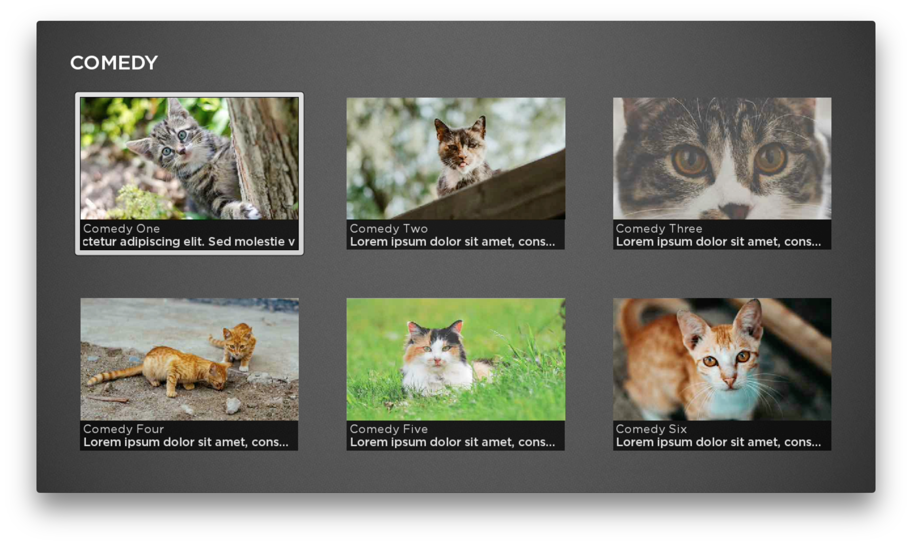

#  Lesson 4
## Parsing JSON, Data Driven UI
In this lesson we will refactor the feed loading to centralize the logic into `HomeScene.brs`. We will also add a parser for the external JSON and display the feed as a grid of thumbnails.

OK, let's go:

1. In HomeScene.brs, add update `init()`:
    ``` java

    function init()
    	? "[HomeScene] init"
    	m.categoryScreen = m.top.findNode("categoryScreen")
    	m.contentScreen = m.top.findNode("contentScreen")

    	m.categoryScreen.observeField("categorySelected", "onCategorySelected")
    	m.categoryScreen.setFocus(true)
    end function
    ```
    Notice the new `ContentScreen` reference, we'll get to that in a minute.  Right now let's deal with the field observer for the category screen. Update the rest of the file, essentially cutting and pasting the code from Lesson 3 into the HomeScene:  

    ``` java

    sub onCategorySelected(obj)
        ? "onCategorySelected field: ";obj.getField()
        ? "onCategorySelected data: ";obj.getData()
        list = m.categoryScreen.findNode("categoryList")
        ? "onCategorySelected checkedItem: ";list.checkedItem
        ? "onCategorySelected selected ContentNode: ";list.content.getChild(obj.getData())
        item = list.content.getChild(obj.getData())
        loadFeed(item.feedUrl)
    end sub

    sub loadFeed(url)
      m.feedTask = createObject("roSGNode", "LoadFeedTask")
      m.feedTask.observeField("response", "onFeedResponse")
      m.feedTask.url = url
      m.feedTask.control = "RUN"
    end sub
    ```
    Notice the use of `findNode("categoryList")`, this syntax looks up the RadioButtonList on the category screen to access the selected ContentNode.  
    Now all that is missing is the `onFeedResponse` handler for the feed data. Add this:

    ``` java

    sub onFeedResponse(obj)
    	response = obj.getData()
    	data = parseJSON(response)
    	if data <> Invalid and data.items <> invalid
            m.categoryScreen.visible = false
            m.contentScreen.visible = true
    		m.contentScreen.feedData = data
    	else
    		? "FEED RESPONSE IS EMPTY!"
    	end if
    end sub
    ```

    Pay attention to the `visible` value on the screens. This logic hides the category list, and shows the content grid. Also notice the use of `parseJSON()`, this is a global method that will convert a JSON string into an Associative Array.

1. Go back into `CategoryScreen.brs` and delete all the code so you are left with just the `init()` function:
    ``` java

    function init()
        m.categoryList=m.top.findNode("categoryList")
        m.categoryList.setFocus(true)
    end function
    ```
    Then open `CategoryScreen.xml` and add a field the interface:  
    ``` xml
    <interface>
      <field id="categorySelected"
              type="assocarray"
              alias="categoryList.itemSelected"
          />
    </interface>
    ```  
    The `alias` attribute allows the component to expose a child's field.  This will allow the HomeScene to observe the list changes.  
    Here are the docs: https://sdkdocs.roku.com/display/sdkdoc/interface

1.  The next steps will create the `ContentScreen` referenced above. Open `HomeScene.xml` and update it to include the new child:  
    ``` xml
    <?xml version="1.0" encoding="utf-8" ?>
    <component name="HomeScene" extends="Scene" initialFocus="categoryScreen">
      <script type="text/brightscript" uri="pkg:/components/HomeScene.brs" />
      <children>
        <CategoryScreen
          id="categoryScreen"
          visible="true"
          translation="[0,0]" />
        <ContentScreen
          id="contentScreen"
          visible="false"
          translation="[0,0]" />
      </children>
    </component>
    ```

    In the `components/screens` directory, create a file `ContentScreen.xml` and add the following:
    ``` xml
    <?xml version="1.0" encoding="utf-8" ?>
    <component   name="ContentScreen"   extends="Group"   initialFocus="contentGrid" >
        <script type="text/brightscript" uri="pkg:/components/screens/ContentScreen.brs" />
        <interface>
          <field id="feedData"
              type="assocarray"
              onChange="onFeedChanged"
              />
        </interface>
        <children>
            <Label
            translation="[75, 75]"
              id="header"
              color="0xFFFFFF"
              font="font:LargeBoldSystemFont"
              text=""/>
            <PosterGrid
              id="contentGrid"
              translation="[100,175]"
              basePosterSize="[500,280]"
              itemSpacing="[110,110]"
              caption1NumLines="1"
              caption2NumLines="1"
              numColumns="3"
              numRows="4"
              />
        </children>
    </component>
    ```  

    Create the companion file `ContentScreen.brs` and add the following:  

    ``` java

    sub init()
        m.contentGrid = m.top.FindNode("contentGrid")
        m.header = m.top.FindNode("header")
    end sub  

    sub onFeedChanged(obj)
        feed = obj.getData()
        m.header.text = feed.title
        postercontent = createObject("roSGNode","ContentNode")
        for  i=0 to 5 step 1
            node = createObject("roSGNode","ContentNode")
            node.HDGRIDPOSTERURL = "http://10.0.0.42:8888/roku_lessons/images/thumbnail-comedy1.jpg"
            node.SHORTDESCRIPTIONLINE1 = "ITEM No. "+ i.toStr()
            node.SHORTDESCRIPTIONLINE2 = "This is a description."
            postercontent.appendChild(node)
        end for
        showpostergrid(postercontent)
    end sub  

    sub showpostergrid(content)
      m.contentGrid.content=content
      m.contentGrid.visible=true
      m.contentGrid.setFocus(true)
    end sub
    ```  

    This code creates some placeholder data to verify the PosterGrid is rendering correctly. The pattern is very similar to the data provided to the category list. There is a single parent node, then a `for` loop creates some dummy nodes to populate it.  
    Run the app and select a category, a grid of content should appear with the title from the JSON at the top of the screen:  
    

1. Finally, edit the `onFeedChanged()` function to use the data provided by the feed. Some of these properties will be used later when video playback is added to the app.
    ``` java
    
    sub onFeedChanged(obj)
        feed = obj.getData()
        m.header.text = feed.title
        postercontent = createObject("roSGNode","ContentNode")
        for each item in feed.items
            node = createObject("roSGNode","ContentNode")
            node.streamformat = item.streamformat
            node.title = item.title
            node.url = item.url
            node.description = item.description
            node.HDGRIDPOSTERURL = item.thumbnail
            node.SHORTDESCRIPTIONLINE1 = item.title
            node.SHORTDESCRIPTIONLINE2 = item.description
            postercontent.appendChild(node)
        end for
        showpostergrid(postercontent)
    end sub
    ```
    Check the results:  
    

    Notice how almost all the application logic is now centralized in the home scene. You could think of the home scene as the "controller" in a Model View Controller architecture.  As the course progresses, most of the additional functionality will be added here.

That's it for Lesson 4.

Next Up:   
[Lesson 5: Back Button, Details Screen with Play Button, Video Screen](Lesson5.md)  
