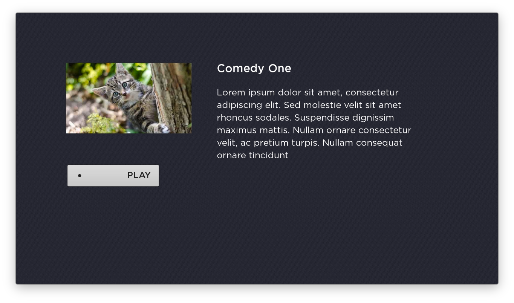

#  Lesson 5  
## Back Button, Details Screen with Play Button, Video Screen
In this lesson we will improve the back button handling, add a new screen to show details of the selected media, and add the Video node.

1. When we run the app and get to eh content screen, pressing the back button closes the app. This is bad, we want to return to the category screen. To fix it, open `HomeScene.brs` and edit the onKeyPress function:
    ``` java

    function onKeyEvent(key, press) as Boolean
    	? "[HomeScene] onKeyEvent", key, press
    	if key = "back" and press
    		if m.contentScreen.visible
    			m.contentScreen.visible=false
    			m.categoryScreen.visible=true
    			m.categoryScreen.setFocus(true)
    			return true
    		end if
    	end if
      return false
    end function
    ```
    This logic checks to see if the content screen is currently visible, then hides it and shows the category screen. Otherwise the event is not handled. In the debugger, you will see that each key press results in 2 messages. This is because the "press" value is `true` for the key down, then `false` for the key release. That's why there is a conditional to verify the `press` value here:  `if key = "back" and press`.  
    Also, this function must return `true` if the key press is being handled, otherwise the event will continue to bubble up the UI nodes.
    Read more here: https://sdkdocs.roku.com/display/sdkdoc/Remote+Control+Events  

2. At this point, when you run the app and navigate to the content screen, you will not be able to use the category list after pressing the back button. We need to explicitly set focus when the screen becomes visible. Open `CategoryScreen.brs` and add code to handle the `visible` field change:  
    ``` java

    function init()
        m.categoryList = m.top.findNode("categoryList")
        m.categoryList.setFocus(true)
    	  m.top.observeField("visible", "onVisibleChange")
    end function

    sub onVisibleChange()
    	if m.top.visible = true then
    		m.categoryList.setFocus(true)
    	end if
    end sub
    ```

    Go ahead and add the same logic to `ContentScreen.brs`:  

    ``` java

    sub init()
        m.contentGrid = m.top.FindNode("contentGrid")
        m.header = m.top.FindNode("header")
    	  m.top.observeField("visible", "onVisibleChange")
    end sub

    sub onVisibleChange()
    	if m.top.visible = true then
    		m.contentGrid.setFocus(true)
    	end if
    end sub
    ```
    Now run the app and notice how the category list has focus when you navigate to it.

3. Next the app needs a details screen to show once a content item is selected. In the `screens` directory, create a new file called `DetailsScreen.xml`:  
    ``` xml
    <?xml version="1.0" encoding="utf-8" ?>
    <component name="DetailsScreen" extends="Group">
    	<interface>
    		<!-- Content fields -->
    		<field id="content"
    		    type="node"
    		    alwaysnotify="true"
    		    onChange="OnContentChange" />
    		<field id="playButtonPressed"
    		    type="int"
    		    alwaysnotify="true"
    		    alias="playButton.buttonSelected" />
    	</interface>
    	<script type="text/brightscript" uri="pkg:/components/screens/DetailsScreen.brs" />
    	<children>
        <Poster
            id="thumbnail"
            width="500"
            height="280"
            translation="[200,200]" />
        <Button
            id="playButton"
            text="PLAY"
            translation="[200, 600]" />
        <Label
            id="title"
            font="font:LargeBoldSystemFont"
            color="0xFFFFFF"
            text=""
            translation="[800,200]" />
        <Label
            id="description"
            font="font:MediumSystemFont"
            color="0xFFFFFF"
            wrap="true"
            width="800"
            text=""
            translation="[800,300]" />
    	</children>
    </component>
    ```  

    Create the companion BrightScript file, called `DetailsScreen.brs`:  

    ``` java

    sub init()
    	m.title = m.top.FindNode("title")
    	m.description = m.top.FindNode("description")
    	m.thumbnail = m.top.FindNode("thumbnail")
    	m.playButton = m.top.FindNode("playButton")
    	m.top.observeField("visible", "onVisibleChange")
    	m.playButton.setFocus(true)
    end sub

    sub onVisibleChange()
    	if m.top.visible = true then
    		m.playButton.setFocus(true)
    	end if
    end sub

    sub OnContentChange(obj)
    	item = obj.getData()
    	m.title.text = item.title
    	m.description.text = item.description
    	m.thumbnail.uri = item.HDGRIDPOSTERURL
    end sub
    ```

    Notice how the visibility handler is included here. The only UI element on this screen is a <kbd>PLAY</kbd> button to start content, and it should always recieve focus when the screen appears.  
    There are 2 fields exposed in the interface. `content` allows the application to update the ContentNode for the screen, and `playButtonPressed` exposes when a user clicks the button.

1. To add the screen to the application, open `HomeScene.xml` and edit the children:  
    ``` xml
    <?xml version="1.0" encoding="utf-8" ?>
    <component name="HomeScene" extends="Scene" initialFocus="categoryScreen">
      <script type="text/brightscript" uri="pkg:/components/HomeScene.brs" />
      <children>
        <CategoryScreen
          id="categoryScreen"
          visible="true"
          translation="[0,0]" />
        <ContentScreen
          id="contentScreen"
          visible="false"
          translation="[0,0]" />
        <DetailsScreen
          id="detailsScreen"
          visible="false"
          translation="[0,0]" />
      </children>
    </component>
    ```
    Update `HomeScene.brs` to handle the selection from the content screen. This will update the details screen data, hide the content screen, and show the details screen.  

    ``` java

    function init()
    	? "[HomeScene] init"
    	m.categoryScreen = m.top.findNode("categoryScreen")
    	m.contentScreen = m.top.findNode("contentScreen")
    	m.detailsScreen = m.top.findNode("detailsScreen")

    	m.categoryScreen.observeField("categorySelected", "onCategorySelected")
    	m.contentScreen.observeField("contentSelected", "onContentSelected")

    	m.categoryScreen.setFocus(true)
    end function

    sub onContentSelected(obj)
      rowList = m.contentScreen.findNode("rowList")
      rowListContent = rowList.content.getChild(0).getChild(selectedIndex)
      m.detailsScreen.content = rowListContent
      m.contentScreen.visible = false
      m.detailsScreen.visible = true
    end sub
    ```
    
    Update `ContentScreen.xml` and add the following field to the interface.
    ``` xml
        <field id="contentSelected"
        type="assocarray"
        alias="rowList.itemSelected"
        />
     ```
    Run the app and select an item on the content screen to see the new details screen:
    

1. The next step is to add a Video node, then handle the <kbd>PLAY</kbd> button press to show it. Edit the `HomeScene.xml` to add a `Video` node to the `<children>`:
    ``` xml
    <?xml version="1.0" encoding="utf-8" ?>
    <component name="HomeScene" extends="Scene" initialFocus="categoryScreen">
      <script type="text/brightscript" uri="pkg:/components/HomeScene.brs" />
      <children>
        <CategoryScreen
          id="categoryScreen"
          visible="true"
          translation="[0,0]" />
        <ContentScreen
          id="contentScreen"
          visible="false"
          translation="[0,0]" />
        <DetailsScreen
          id="detailsScreen"
          visible="false"
          translation="[0,0]" />
        <Video
          id="videoplayer"
          visible="false"
          translation="[0,0]"
          width="1920"
          height="1080" />
      </children>
    </component>
    ```

    Now update `HomeScene.brs` `init()` with a reference to the Video node, and a field observer on the DetailsScreen. Remember that `DetailsScreen.xml` exposes a field for handling the button.

    ``` java

    function init()
    	? "[HomeScene] init"
    	m.categoryScreen = m.top.findNode("categoryScreen")
    	m.contentScreen = m.top.findNode("contentScreen")
    	m.detailsScreen = m.top.findNode("detailsScreen")
    	m.videoplayer = m.top.findNode("videoplayer")

    	m.categoryScreen.observeField("categorySelected", "onCategorySelected")
    	m.contentScreen.observeField("contentSelected", "onContentSelected")
    	m.detailsScreen.observeField("playButtonPressed", "onPlayButtonPressed")

    	m.categoryScreen.setFocus(true)
    end function
    ```

    And the handler:

    ``` java

    sub onPlayButtonPressed(obj)
    	m.detailsScreen.visible = false
    	m.videoplayer.visible = true
    	m.videoplayer.setFocus(true)
    end sub
    ```

    Run the app, and notice how a black screen takes over when you select the play button. This is the Video node. In the next lesson we'll enable playback.
    By now you should be familiar with the basic UI building pattern. To create a new screen, you write a component (XML and BrightScript) then add a new node to the home scene. Then update the home scene to handle the screen events.

1. Finally, update the key press handler in `HomeScene.brs` to make the back button work with the video node and details screen:
    ``` java
    
    function onKeyEvent(key, press) as Boolean
    	? "[HomeScene] onKeyEvent", key, press
    	if (key = "back" and press)
    		if (m.contentScreen.visible)
    			m.contentScreen.visible = false
    			m.categoryScreen.visible = true
    			m.categoryScreen.setFocus(true)
    			return true
    		else if (m.detailsScreen.visible)
    			m.detailsScreen.visible = false
    			m.contentScreen.visible = true
    			m.contentScreen.setFocus(true)
    			return true
    		else if (m.videoplayer.visible)
    			m.videoplayer.visible = false
    			m.detailsScreen.visible = true
    			m.detailsScreen.setFocus(true)
    			return true
    		end if
    	end if
      return false
    end function
    ```

That's it for lesson 5.

Next Up:   
[Lesson 6: Video Playback, Dialogs](Lesson6.md)  
